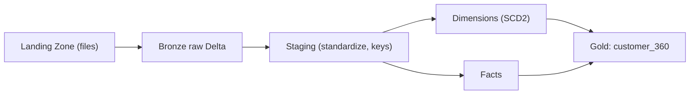
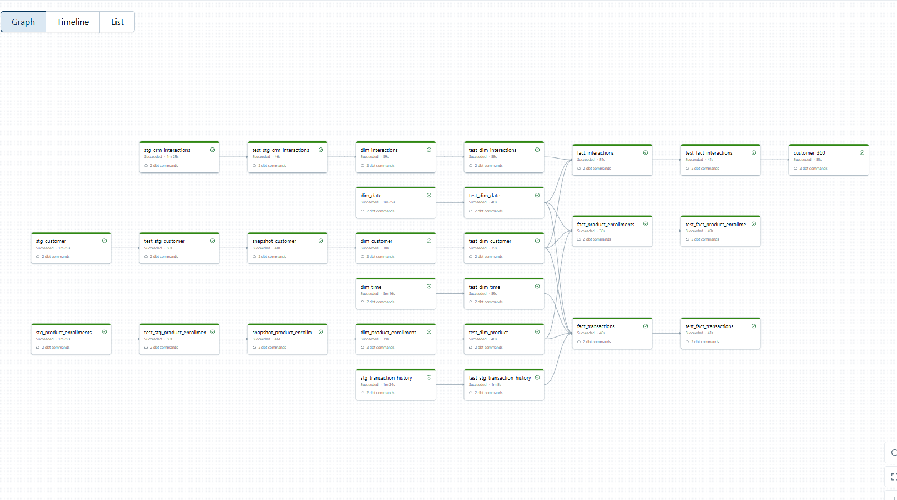
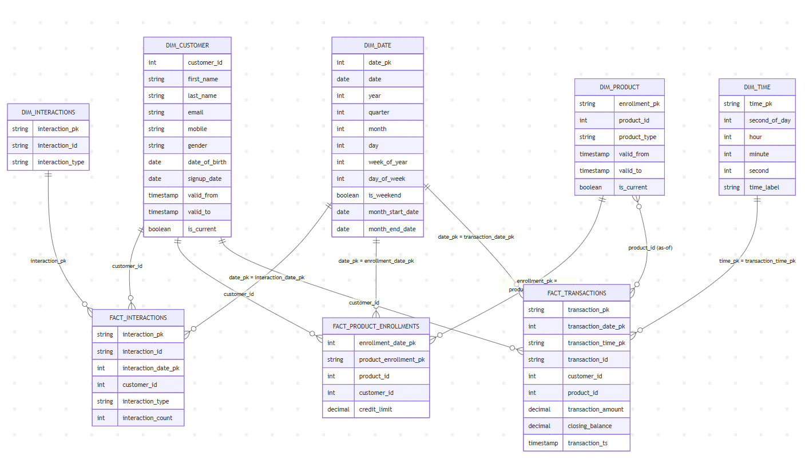

# Customer 360 on Databricks (dbt + Delta)

> Build a gold-layer **customer\_360** table on Databricks using dbt, with SCD2 dimensions, robust tests, and clear business logic.

---

## 🔎 Problem & Goal

Create a unified **Customer 360** profile from four feeds: `customer_raw`, `product_enrollments`, `crm_interactions`, `transaction_history`. Standardize raw data, track slowly changing attributes, define **active customers**, aggregate holdings, and expose value/engagement metrics for analytics and downstream apps.

---

## 📦 Inputs

* **customer\_raw** – natural customer row (name, email, dob, signup\_date, etc.)
* **product\_enrollments** – product ownership/enrollments with credit\_limit
* **crm\_interactions** – dated touches with `interaction_type`
* **transaction\_history** – dated transactions with amount and status

Primary join key: `customer_id` (stable). If not stable, derive a unified key in staging (hash of natural keys).

## 🧭 Data Flow (Medallion)



**Conventions**

* Normalize categorical strings to **lowercase** in staging.
* Generate **hash surrogate keys** in staging where needed.
* Use **SCD Type 2** snapshots for `customer` and `product_enrollments`.

---

---

## 🔗 Data Lineage



---

---

## 🧱 Data Modelling



* **Dim**: `dim_customer` (SCD2), `dim_product` (SCD2 from product enrollments), `dim_date`, `dim_time`, `dim_interactions`
* **Fact**: `fact_transactions`, `fact_product_enrollments`, `fact_interactions`
* **Mart**: `customer_360` (1 row per **customer\_id**)

### customer\_360 Columns (proposed)

* Identity: `customer_id`, `first_name`, `last_name`, `email`, `mobile`, `gender`, `date_of_birth`, `signup_date`
* Activity: `is_active90`, `last_transaction_date`, `last_interaction_date`
* Value: `txn_count_90d`, `txn_amount_90d`, `total_txn_value_lifetime`
* Holdings: `products_held_count`, `product_types_held`, `total_credit_limit_current`
* Metadata: `built_at`

---

## 🧠 Business Logic (dbt SQL) and explaination


**File:** `models/gold/customer/customer_360.sql`

```sql
{{ config(materialized='table') }}



with window as (
  select date_sub(current_date(), {{ lookback_days - 1 }}) as start_date,
         current_date()                                   as end_date
),
-- 1) Current customers from SCD2
cust as (
  select customer_id, first_name, last_name, email, mobile, gender,
         date_of_birth, signup_date
  from {{ ref('dim_customer') }}
  where is_current = true
),
-- 2) Transactions in window
_tx as (
  select t.customer_id,
         d.date           as event_date,
         t.transaction_amount
  from {{ ref('fact_transactions') }} t
  join {{ ref('dim_date') }} d on d.date_pk = t.transaction_date_pk
  join window w on d.date between w.start_date and w.end_date
  where abs(t.transaction_amount) <> 0
),
_tx_agg as (
  select customer_id,
         count(*)                       as txn_count_90d,
         round(sum(transaction_amount),2) as txn_amount_90d,
         max(event_date)                as last_transaction_date
  from _tx group by 1
),
-- 3) Interactions in window
_intr as (
  select fi.customer_id,
         d.date as event_date
  from {{ ref('fact_interactions') }} fi
  join {{ ref('dim_date') }} d on d.date_pk = fi.interaction_date_pk
  join window w on d.date between w.start_date and w.end_date
),
_intr_agg as (
  select customer_id,
         count(*) as interactions_90d,
         max(event_date) as last_interaction_date
  from _intr group by 1
),
-- 4) Current holdings + total credit limit (current products only)
_holdings as (
  select fpe.customer_id,
         count(*) as products_held_count,
         concat_ws(', ', collect_set(lower(trim(dp.product_type)))) as product_types_held,
         sum(case when lower(trim(dp.product_type)) = 'credit card'
                  then coalesce(fpe.credit_limit, 0.0) else 0.0 end) as total_credit_limit_current
  from {{ ref('fact_product_enrollments') }} fpe
  join {{ ref('dim_product') }} dp on dp.product_id = fpe.product_id and dp.is_current = true
  group by fpe.customer_id
),
-- 5) Lifetime value (successful transactions only if status present)
_ltv as (
  select customer_id,
         round(sum(transaction_amount),2) as total_txn_value_lifetime
  from {{ ref('fact_transactions') }}
  group by 1
),
final as (
  select c.customer_id,
         c.first_name, c.last_name, c.email, c.mobile, c.gender,
         c.date_of_birth, c.signup_date,
         case when coalesce(x.txn_count_90d,0) > 0 or coalesce(i.interactions_90d,0) > 0 then true else false end as is_active90,
         x.last_transaction_date,
         i.last_interaction_date,
         coalesce(x.txn_count_90d,0)              as txn_count_90d,
         coalesce(x.txn_amount_90d,0.0)           as txn_amount_90d,
         coalesce(l.total_txn_value_lifetime,0.0) as total_txn_value_lifetime,
         coalesce(h.products_held_count,0)        as products_held_count,
         h.product_types_held,
         coalesce(h.total_credit_limit_current,0.0) as total_credit_limit_current
  from cust c
  left join _tx_agg     x on x.customer_id = c.customer_id
  left join _intr_agg   i on i.customer_id = c.customer_id
  left join _holdings   h on h.customer_id = c.customer_id
  left join _ltv        l on l.customer_id = c.customer_id
)
select * from final
where is_active90 = true;
```

**Purpose.** Produce a one‑row‑per‑customer gold table with an **activity window** and consolidated value/holding metrics.

**Config.** The lookback window is controlled by `vars.customer360_90_days` (default **90** days). This makes the metric reproducible and easy to tune per environment.

### How the SQL works (step‑by‑step)

1. **Define the window**
   Build a `window` CTE that computes `start_date = current_date() - (lookback_days - 1)` and `end_date = current_date()`.

2. **Current customer slice (SCD2)**
   Pull customers from `dim_customer` with `is_current = true`. This ensures the profile reflects the latest known attributes while historical state remains available in the snapshot tables.

3. **Transactions within the window**
   Join `fact_transactions` to `dim_date` to derive a calendar `event_date`, filter to the window, exclude zero amounts, then aggregate per customer:

   * `txn_count_90d` (number of transactions),
   * `txn_amount_90d` (sum of `transaction_amount`, rounded),
   * `last_transaction_date` (max `event_date`).

4. **Interactions within the window**
   Join `fact_interactions` to `dim_date`, filter to the window, aggregate per customer:

   * `interactions_90d`,
   * `last_interaction_date`.

5. **Current holdings & credit exposure**
   Join `fact_product_enrollments` with `dim_product` where `is_current = true` to reflect **today’s** portfolio. Compute:

   * `products_held_count` (count of current products),
   * `product_types_held` (distinct, lower‑cased list),
   * `total_credit_limit_current` (sum of `credit_limit` for `product_type = 'credit card'`).

6. **Lifetime value**
   Sum `transaction_amount` over the full `fact_transactions` history to get `total_txn_value_lifetime`. (If a status column exists, restrict to successful states.)

7. **Activity flag**
   `is_active90 = (txn_count_90d > 0) OR (interactions_90d > 0)`. This captures both **monetary** and **engagement** activity.

8. **Final select (+ optional filter)**
   Project the identity columns and all metrics. The sample SQL returns **only active customers** via `WHERE is_active90 = true`. Remove this clause if you want the full population and use `is_active90` as a dimension.

---


## 🗂️ Repo Structure (expanded)

```
.
├─ .github/workflows/
│  └─ databricks.yml            # CI runner (reference only)
├─ Assets/                      # Images for README
├─ setup/
│  ├─ DDL step.ipynb            # Bootstrap catalogs/schemas; upload Landing files
│  └─ etl_pipelines.yml         # Databricks Workflow (Jobs) definition
├─ snapshots/
│  ├─ snp_customer.sql
│  └─ snp_product_enrollments.sql
├─ models/
│  ├─ staging/                  
│  ├─ silver/ # store dim and fact
│  └─ gold/
│     └─ customer/customer_360.sql
├─ tests/
├─ dbt_project.yml
├─ packages.yml
└─ README.md
```

---

## 🏗️ Databricks Setup
### 1) DDL & Storage
- Create **catalog**/**schema** for `bronze`, `staging`, `landing`, `gold`.
- Create **external locations** for Landing/Bronze if using cloud storage (S3/ADLS/GCS) ( future Improvement)
- **Upload files to Landing** (e.g., `abfss://<container>@<account>.dfs.core.windows.net/landing/...`). ( future Improvement)
- Ingest to **Bronze** via Auto Loader or COPY INTO, using schemas-on-read and Delta tables.

### 2) Pipelines / Workflows
- **Task 1**: Ingest Landing → Bronze (Auto Loader | DLT).  
- **Task 2**: Run dbt `staging` models (normalize text: lowercase categories, trim whitespace; derive hash keys).  
- **Task 3**: Build **snapshots** (SCD2 for customer, product_enrollment).  
- **Task 4**: Build **dims/facts**.  
- **Task 5**: Build `customer_360` and run tests + docs.  
- **Task 6**: Publish to downstream (BI/serving) if needed.

---

## 🔒 Snapshots (SCD2)
- `snp_customer`: capture historical attribute changes; `dim_customer` selects `is_current = true` and exposes validity window.
- `snp_product_enrollments`: track product validity and credit limit changes.

> Joins in facts filter by event timestamp within `[valid_from, valid_to)` to ensure historical correctness.

---

## 🚀 Running

Assume we already setup fully functional on Databrick ( databrick repos, catalog, ingestion pipeline)
Check setup file on setup folder

```bash
./update.sh
```

---

## 🧭 CI/CD

* GitHub Actions: `dbt deps`, `dbt build`, artifacts: run results + docs.
* Run via Databricks Workflows using `databricks jobs run` or `dbx`.

---

## 🧪 Testing 

**Current state** ( Edge cases handled )

* **Accepted values**: later enforce controlled vocabularies (e.g., `gender` ∈ {male, female}; `interaction_type` ∈ {email, phone, chat}).
* **Relationships**: facts → dims (transactions, interactions, enrollments to customers/products/date/time).
* **Keys**: `unique` + `not_null` on `customer_360.customer_id`, `dim_customer.customer_id`, ... and surrogate keys as applicable.
* **format**: Format: Enforce consistent phone number formats (e.g., disallow +63, require numbers to start with 0).

**Plan to add other tests (later)**
* **Integrity checks**: no future dates; non‑zero amounts for payable statuses; SCD2 window non‑overlap.
* **Freshness**: source freshness for critical feeds (transaction & customer).

**Where to place tests**

* Add YAML under `models/silver/schema.yml` and `models/gold/schema.yml` when ready.
* Keep snapshot validation tests (SCD2 window checks) under `snapshots/` or as generic tests in `tests/`.

## 📬 Contact & License

* Author: Edward • Email: edwardngu96@gmail.com
* License: MIT (or company standard)

---

## 🧾 Changelog

* 2025-09-22 — Initial Databricks version with business logic, SCD2 snapshots, tests.

---
